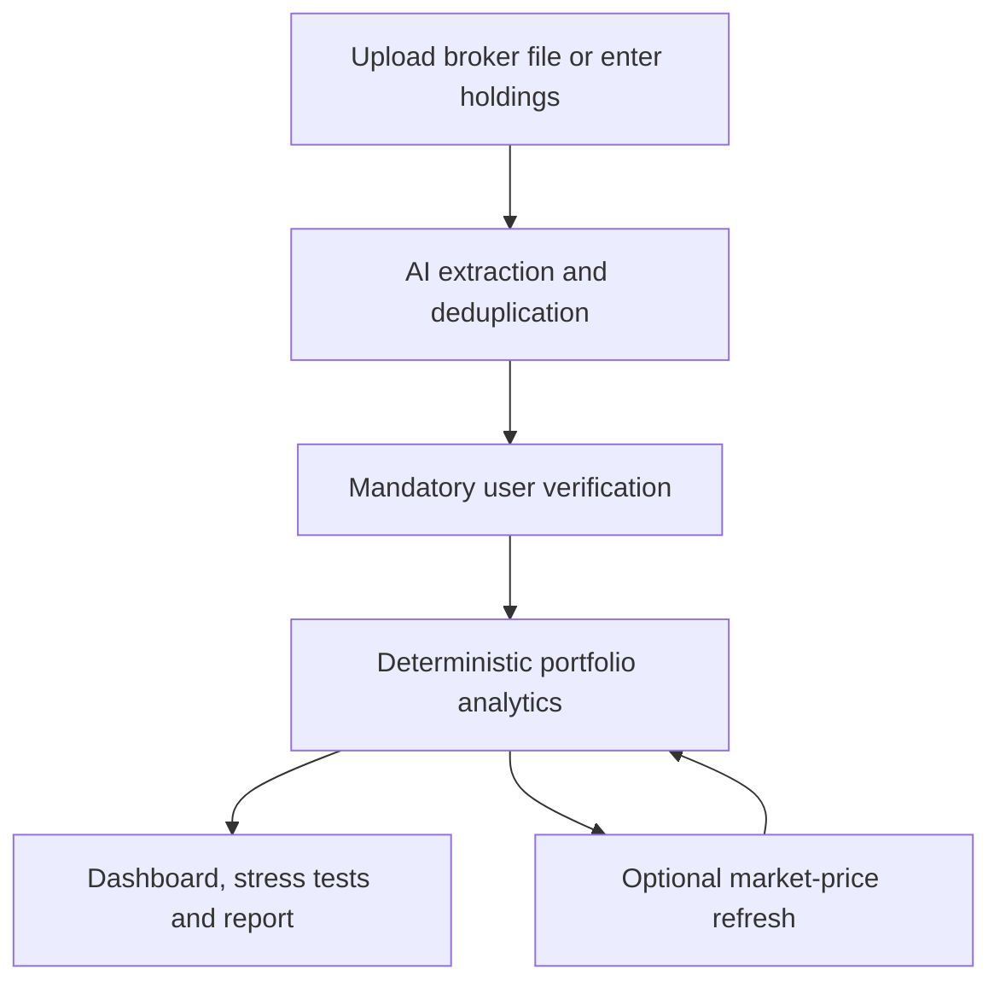
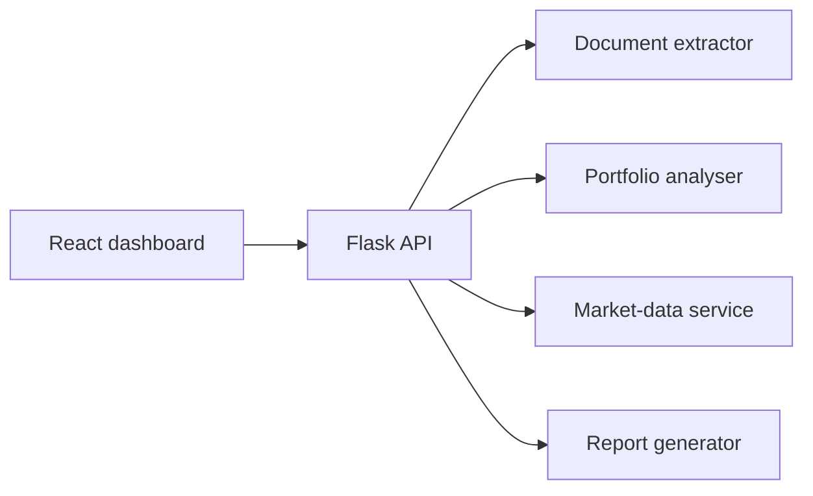

# PortfolioLens

**AI-assisted portfolio intelligence for Indian equity investors.**

[](https://react.dev/)
[](https://flask.palletsprojects.com/)
[](https://platform.openai.com/)
[](https://vite.dev/)
[](#testing)

[**View the live demo**](https://portfolio-lens-delta.vercel.app/) · [**Explore the source code**](https://github.com/Hisham1920/portfolio-lens)

PortfolioLens converts broker screenshots, PDFs, or manually entered holdings into an interactive portfolio dashboard. It helps users understand performance, allocation, concentration, downside exposure, and portfolio health without requiring them to interpret raw broker data.

> The public deployment is a safe demonstration using bundled sample data. Uploads and paid AI actions are available only when the full backend is run locally.

## Why this project

Retail investors often receive holdings data as screenshots or broker statements, while most portfolio tools expect clean spreadsheets or manual entry. PortfolioLens closes that gap by combining multimodal extraction, mandatory human verification, deterministic financial analytics, market-price refresh, and readable reporting in one workflow.

## Core capabilities

### Portfolio ingestion

- Upload JPG, JPEG, PNG, or PDF portfolio files.
- Read Zerodha, Upstox, and generic broker layouts.
- Process up to six overlapping screenshots and remove duplicate holdings.
- Extract only visible rows instead of inventing holdings from totals such as `Holdings (9)`.
- Prefill symbol, company, quantity, average price, current price, sector, and market cap.
- Highlight low-confidence values and require user verification before analysis.
- Keep manual portfolio entry as a complete alternative.

### Analytics and risk

- Current value, invested value, total P&L, and portfolio return.
- Winners, losers, gross gains, gross losses, and profit factor.
- Sector and market-cap allocation and performance.
- Single-stock, top-three, and sector concentration analysis.
- Effective holdings, diversification score, health score, and risk decomposition.
- Return contribution, break-even movement, and equal-weight comparison by holding.
- Four preset downside scenarios plus interactive market and sector stress tests.

### Market data and reports

- Refresh supported NSE holdings with the latest available Yahoo Finance snapshot.
- Cache quotes for five minutes to reduce provider traffic and rate-limit risk.
- Preserve the previous price when an individual symbol cannot be refreshed.
- Normalize broker formats such as `NSE:RELIANCE`, `NSE_EQ|RELIANCE`, and `RELIANCE-EQ`.
- Detect legacy `TATAMOTORS` positions and require record-date confirmation before resolving the demerger.
- Split eligible Tata Motors positions 1:1 into `TMPV` and `TMCV`, preserving total cost with the official 68.85% / 31.15% allocation.
- Generate a free deterministic written report from verified calculations.
- Optionally request a clearly labelled AI interpretation with separate consent.
- Export either report as a formatted PDF.

## Product workflow



The AI is used to read unstructured documents and optionally explain results. Portfolio calculations themselves are deterministic and are recomputed from the verified holdings.

## Engineering decisions

| Decision | Reason |
| --- | --- |
| Mandatory review after extraction | Financial screenshots can be ambiguous; users must verify every value before analysis. |
| Deterministic analytics engine | Metrics should be reproducible and should not depend on generative model output. |
| Explicit consent for AI calls | Uploads and optional AI reports should never be sent without a deliberate user action. |
| In-memory file processing | Original uploaded documents are not saved by the Flask application. |
| Five-minute quote cache | Reduces unnecessary provider calls without using OpenAI API credit. |
| Partial refresh protection | A failed symbol retains its existing price instead of breaking or corrupting the portfolio. |
| Confirmed corporate-action resolver | Legacy Tata Motors positions are changed only after record-date confirmation; the official entitlement and cost-basis allocation are applied transparently. |
| Safe public-demo mode | Recruiters can explore the product without exposing private uploads, backend secrets, or API credit. |

The Tata Motors resolver follows the [company's NSE-filed shareholder entitlement and cost-allocation notice](https://nsearchives.nseindia.com/corporate/TATAMOTORSSJS_12112025224654_NSEBSECOAFINAL.pdf): one commercial-vehicle share per legacy share, with 68.85% of original cost assigned to TMPV and 31.15% to TMCV.

## Tech stack

| Layer | Technology |
| --- | --- |
| Frontend | React, Vite, Recharts, Lucide React, CSS |
| Backend | Python, Flask, Pydantic |
| AI extraction and interpretation | OpenAI API with structured responses |
| Market snapshot prototype | Yahoo Finance chart endpoint with an in-memory TTL cache |
| PDF generation | ReportLab |
| Testing | Python `unittest`, mocked external AI and market-data calls |
| Deployment | Vercel for the public demonstration frontend |

## Architecture



The public Vercel build loads bundled demonstration analytics and disables uploads and paid AI actions. The local full-stack version connects the React frontend to Flask at `http://127.0.0.1:5000`.

## Cost-conscious API design

| User action | OpenAI API usage |
| --- | --- |
| Upload and extract a screenshot or PDF | One extraction request |
| Review or manually edit holdings | None |
| Run analytics, charts, risk analysis, or stress tests | None |
| Refresh supported market prices | None |
| Read or download the automated report | None |
| Generate the optional AI interpretation | One report request |
| Reopen an unchanged cached AI report | None |

The default analytical experience therefore remains available after extraction without consuming additional OpenAI credit.

## Run locally on Windows

### Quick start

1. Clone or download the repository.
2. Double-click `start-backend.bat`.
3. On the first run, add your OpenAI API key to the generated `backend\.env` file, save it, and close Notepad.
4. Keep the backend terminal open.
5. Double-click `start-frontend.bat`.
6. Open `http://localhost:5173`.

If port `5173` is already occupied, Vite may use `5174`; both local addresses are accepted by the backend.

### Manual setup

Backend:

```bat
cd backend
python -m venv .venv
.\.venv\Scripts\activate.bat
pip install -r requirements.txt
copy .env.example .env
notepad .env
python app.py
```

Frontend, in a second Command Prompt:

```bat
cd frontend
npm install
npm run dev
```

## Environment variables

Create `backend/.env` from `backend/.env.example`:

```env
OPENAI_API_KEY=your_private_key
OPENAI_MODEL=gpt-5.6
OPENAI_REASONING_EFFORT=high
OPENAI_REPORT_MODEL=gpt-5.6-luna
OPENAI_REPORT_REASONING_EFFORT=low
MARKET_PRICE_CACHE_SECONDS=300
FRONTEND_ORIGINS=
```

Never commit `backend/.env`. The file is excluded through `.gitignore`.

## Testing

```bash
cd backend
python -m unittest discover -s tests -v

cd ../frontend
npm run lint
npm run build
```

- 26 backend tests cover analytics consistency, extraction validation, deduplication, reports, PDF generation, market-symbol handling, caching, partial failures, and API routes.
- External OpenAI and market-data requests are mocked, so the automated test suite does not spend API credit.
- The Vite production build is verified before release.

## API endpoints

| Method | Endpoint | Purpose |
| --- | --- | --- |
| `GET` | `/api/health` | Backend health check |
| `GET` | `/api/portfolio/demo` | Generate the demonstration analysis |
| `POST` | `/api/portfolio/extract` | Extract holdings from consented uploads |
| `POST` | `/api/portfolio/analyse` | Analyse verified holdings |
| `POST` | `/api/portfolio/refresh-prices` | Refresh supported NSE market snapshots |
| `POST` | `/api/portfolio/report/ai` | Generate an optional AI interpretation |
| `POST` | `/api/portfolio/report/pdf` | Export a selected report as PDF |

## Privacy, accuracy, and financial-data notes

- Remove account numbers and unnecessary personal information before uploading.
- Uploaded files are processed in memory and sent to the OpenAI API only after explicit consent.
- AI extraction and interpretation can make mistakes; extracted numbers must be verified.
- Yahoo Finance snapshots may be delayed and are not exchange-certified real-time quotes.
- The free market-data integration is an MVP prototype, not a licensed commercial feed.
- A production financial product should use an authorized broker or exchange-data provider and a protected hosted backend.
- PortfolioLens provides educational analytics, not personalized investment advice.

## Project structure

```text
portfolio-lens/
├── backend/
│   ├── services/
│   │   ├── document_extractor.py
│   │   ├── market_data.py
│   │   ├── portfolio_analyser.py
│   │   └── report_generator.py
│   ├── tests/
│   ├── app.py
│   └── sample_data.py
├── frontend/
│   ├── public/
│   └── src/
│       ├── App.jsx
│       └── styles.css
├── start-backend.bat
└── start-frontend.bat
```

## Roadmap

- Replace the free snapshot prototype with a licensed production market-data provider.
- Add authentication and encrypted, user-controlled portfolio persistence.
- Support CSV/XLSX broker exports and additional Indian broker layouts.
- Add benchmark comparison against NIFTY indices.
- Add historical portfolio performance, volatility, beta, and risk-adjusted-return metrics.
- Deploy the protected backend with rate limiting, monitoring, and usage controls.

## Resume summary

> Built PortfolioLens, a React and Flask portfolio-intelligence platform that extracts Indian equity holdings from broker screenshots/PDFs using multimodal AI, validates them through a human-in-the-loop workflow, refreshes supported NSE price snapshots, and computes deterministic performance, allocation, concentration, risk, stress-test, and written-report insights.

---

Built by [Hisham Siddiqui](https://github.com/Hisham1920).
